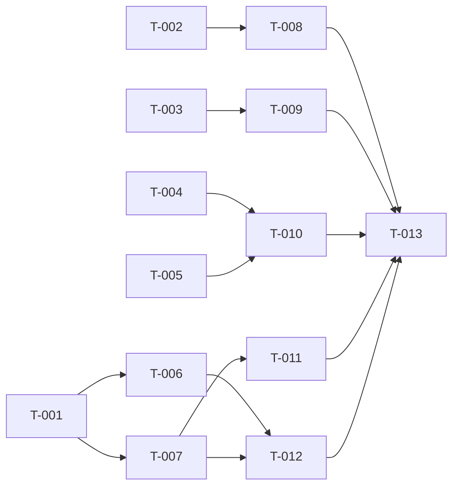

# Build Site

13 tasks across 4 tiers from 2 kits.

Backports applicable hunks of PaperMC patch 0931 ("Improve tag parser handling") into Purpur 1.19.4. Final deliverable is `patches/server/0316-Improve-tag-parser-handling.patch`, produced by editing the Purpur-Server patched source tree and running `./gradlew rebuildPatches`. JUnit tests live alongside source under the server module's test tree.

---

## Tier 0 — No Dependencies (Start Here)

| Task | Title | Cavekit | Requirement | Effort |
|------|-------|---------|-------------|--------|
| T-001 | Add typed NBT depth-exceeded exception | cavekit-world-data-integrity.md | R2 | S |
| T-002 | Cap translatable component visited parts at 32 | cavekit-runtime-dos-protection.md | R1 | M |
| T-003 | Add separator validation helper and route list-style separators through it | cavekit-runtime-dos-protection.md | R2 | M |
| T-004 | Cap suggestion packet command UTF length at 2048 bytes | cavekit-runtime-dos-protection.md | R3 | S |
| T-005 | Spam-kick long single-token tab-complete in suggestion handler | cavekit-runtime-dos-protection.md | R4 | S |

---

## Tier 1 — Depends on Tier 0

| Task | Title | Cavekit | Requirement | blockedBy | Effort |
|------|-------|---------|-------------|-----------|--------|
| T-006 | Bound NBT parser depth via shared instance counter on struct/list open/close | cavekit-world-data-integrity.md | R1, R3 | T-001 | M |
| T-007 | Short-circuit brigadier dispatcher on typed NBT exception | cavekit-runtime-dos-protection.md | R6 | T-001 | M |
| T-008 | JUnit tests for translatable visit cap | cavekit-runtime-dos-protection.md | R1 | T-002 | M |
| T-009 | JUnit tests for separator validation helper | cavekit-runtime-dos-protection.md | R2 | T-003 | M |
| T-010 | JUnit tests for suggestion packet UTF cap and long-no-space spam kick | cavekit-runtime-dos-protection.md | R3, R4 | T-004, T-005 | M |

---

## Tier 2 — Depends on Tier 1

| Task | Title | Cavekit | Requirement | blockedBy | Effort |
|------|-------|---------|-------------|-----------|--------|
| T-011 | Disconnect tab-complete sender when dispatcher parse surfaces typed NBT exception | cavekit-runtime-dos-protection.md | R5 | T-007 | S |
| T-012 | JUnit tests for NBT parser depth bound and brigadier short-circuit | cavekit-world-data-integrity.md, cavekit-runtime-dos-protection.md | R1, R2, R3, R6 | T-006, T-007 | M |

---

## Tier 3 — Depends on Tier 2

| Task | Title | Cavekit | Requirement | blockedBy | Effort |
|------|-------|---------|-------------|-----------|--------|
| T-013 | JUnit tests for suggestion-handler typed-exception disconnect, then regenerate patch file | cavekit-runtime-dos-protection.md | R5 (tests) + all (patch) | T-008, T-009, T-010, T-011, T-012 | M |

---

## Task Detail

### T-001: Add typed NBT depth-exceeded exception
**Cavekit Requirement:** cavekit-world-data-integrity.md / R2
**Acceptance Criteria Mapped:** R2 a/b/c (instanceof distinguishable, lives in upstream Paper brigadier namespace, literal message)
**blockedBy:** none
**Effort:** S
**Description:** Create a new public final class `TagParseCommandSyntaxException` extending `com.mojang.brigadier.exceptions.CommandSyntaxException` in package `io.papermc.paper.brigadier` (the upstream Paper namespace so plugin source compatibility with later Paper versions is preserved). Class holds a private static `SimpleCommandExceptionType` constructed with a `LiteralMessage("Error parsing NBT")` and exposes a single `String`-arg constructor that passes that type plus a `Component.literal(message)` to the parent constructor. Class must be `final` to make the instanceof check authoritative.
**Files:** `Purpur-Server/src/minecraft/java/io/papermc/paper/brigadier/TagParseCommandSyntaxException.java` (new file)
**Test Strategy:** Compile-time check. Type is exercised by T-012's parser tests via instanceof assertions.

### T-002: Cap translatable component visited parts at 32
**Cavekit Requirement:** cavekit-runtime-dos-protection.md / R1
**Acceptance Criteria Mapped:** R1 a (self-ref terminates), R1 b (cross-ref terminates), R1 c (legitimate <=32 renders unchanged), R1 d (no SOE / no unbounded heap)
**blockedBy:** none
**Effort:** M
**Description:** In `TranslatableContents.visit(FormattedText.ContentConsumer<T>)`, wrap the existing decomposition loop in a counting consumer that increments per string-part accepted and throws a sentinel `IllegalArgumentException` once the count exceeds 32. The public `visit` catches the sentinel and falls back to `visitor.accept("...")`. The counting must apply transitively to nested translatable args (any `accept` call from within the visit subtree counts), which is the property that breaks self-referential and cross-referential translation chains.
**Files:** `Purpur-Server/src/minecraft/java/net/minecraft/network/chat/contents/TranslatableContents.java`
**Test Strategy:** T-008 — JUnit cases for self-ref, X→Y→X, and an under-32-part component that renders identically to the upstream path.

### T-003: Add separator validation helper and route list-style separators through it
**Cavekit Requirement:** cavekit-runtime-dos-protection.md / R2
**Acceptance Criteria Mapped:** R2 a (NBT separator → empty), R2 b (selector separator → empty), R2 c (translatable-arg-with-NBT-or-selector → empty), R2 d (plain literal renders), R2 e (recurses through translatable args)
**blockedBy:** none
**Effort:** M
**Description:** Add two new static methods to `ComponentUtils`: (a) `updateSeparatorForEntity(CommandSourceStack, Optional<Component>, Entity, int)` that returns `Optional.empty()` when the input is absent or when `isValidSelector` returns false, otherwise delegates to `updateForEntity`; and (b) `isValidSelector(Component)` which returns false if the component's contents are `NbtContents` or `SelectorContents`, recurses into `TranslatableContents` args (testing each Component arg via `isValidSelector`), and returns true otherwise. Mark the existing `Optional<MutableComponent> updateForEntity(...)` overload with `@io.papermc.paper.annotation.DoNotUse` so future call sites do not silently bypass validation. Swap the two existing call sites in `NbtContents.resolve` (interpreting and non-interpreting branches) and the one in `SelectorContents.resolve` from `updateForEntity` to `updateSeparatorForEntity`.
**Files:** `Purpur-Server/src/minecraft/java/net/minecraft/network/chat/ComponentUtils.java`; `Purpur-Server/src/minecraft/java/net/minecraft/network/chat/contents/NbtContents.java`; `Purpur-Server/src/minecraft/java/net/minecraft/network/chat/contents/SelectorContents.java`
**Test Strategy:** T-009 — JUnit cases per acceptance criterion exercising `isValidSelector` directly (plain literal → true; NbtContents wrapper → false; SelectorContents wrapper → false; TranslatableContents with NBT arg → false; TranslatableContents with all-plain args → true).

### T-004: Cap suggestion packet command UTF length at 2048 bytes
**Cavekit Requirement:** cavekit-runtime-dos-protection.md / R3
**Acceptance Criteria Mapped:** R3 a (>2048 raises protocol length-exceeded), R3 b (<=2048 decodes), R3 c (server-side enforced regardless of client)
**blockedBy:** none
**Effort:** S
**Description:** In `ServerboundCommandSuggestionPacket`'s `FriendlyByteBuf` constructor, change the `buf.readUtf(32500)` call to `buf.readUtf(2048)`. This is the wire decoder so the cap is enforced before any handler logic runs and is independent of the upstream client's outgoing limit.
**Files:** `Purpur-Server/src/minecraft/java/net/minecraft/network/protocol/game/ServerboundCommandSuggestionPacket.java`
**Test Strategy:** T-010 — JUnit cases that construct a `FriendlyByteBuf` with a UTF payload of length 2048 (must decode), length 2049 (must throw the protocol's length-exceeded `DecoderException`), and verify the limit fires before any other constructor work.

### T-005: Spam-kick long single-token tab-complete in suggestion handler
**Cavekit Requirement:** cavekit-runtime-dos-protection.md / R4
**Acceptance Criteria Mapped:** R4 a (65 no-space disconnects), R4 b (200 / first-space at 70 disconnects), R4 c (200 / first-space at 5 permitted), R4 d (64 no-space permitted boundary), R4 e (reuses existing `disconnect.spam` translation and `PlayerKickEvent.Cause.SPAM`), R4 f (occurs before tab-complete dispatch)
**blockedBy:** none
**Effort:** S
**Description:** In `ServerGamePacketListenerImpl.handleCustomCommandSuggestions`, insert a guard immediately after the existing "Don't suggest if tab-complete is disabled" early-return and before the `TAB_COMPLETE_EXECUTOR.execute(...)` dispatch: if the command string length is > 64 AND (`indexOf(' ')` returns -1 OR is >= 64), call `this.disconnect(Component.translatable("disconnect.spam"), PlayerKickEvent.Cause.SPAM)` and return. Boundary semantics must be strict-greater-than 64 on length and strict-greater-than-or-equal 64 on index so a 64-char no-space command is permitted (criterion R4 d).
**Files:** `Purpur-Server/src/minecraft/java/net/minecraft/server/network/ServerGamePacketListenerImpl.java`
**Test Strategy:** T-010 — unit test the predicate `length > 64 && (idx == -1 || idx >= 64)` against the four boundary inputs (65-no-space, 200/70, 200/5, 64-no-space) and assert the expected disconnect/permit decision. The dispatch-ordering criterion (R4 f) is satisfied structurally by inserting the guard before the executor call; a code-inspection check is sufficient.

### T-006: Bound NBT parser depth via shared instance counter on struct/list open/close
**Cavekit Requirement:** cavekit-world-data-integrity.md / R1, R3
**Acceptance Criteria Mapped:** R1 a (512 succeeds), R1 b (513 compound throws typed), R1 c (513 list throws typed), R1 d (513 mixed throws typed), R1 e (decrement on close, no sibling false accumulation); R3 a (every string-source entry path bounded — single struct, brigadier argument, list, and any plugin-facing string-source parse), R3 b (no bypass entry path), R3 c (shared single instance field, reset per parse)
**blockedBy:** T-001
**Effort:** M
**Description:** In `TagParser`, add a private instance field `int depth`. Add a private helper `increaseDepth()` that pre-increments the field and, if `depth > 512`, throws a `TagParseCommandSyntaxException("NBT tag is too complex, depth > 512")` (the typed exception from T-001). In `readStruct`, call `increaseDepth()` immediately after the opening `expect('{')` and decrement `this.depth--` immediately after the closing `expect('}')`. Mirror this in `readList` immediately after the value-readability guard at the top of the parse body and immediately after the closing `expect(']')`. Because the field is per-`TagParser` instance, every entry path that constructs a `TagParser` shares the counter for the lifetime of one parse and starts fresh for a new parse, which is the R3 c property. Verify the closed set of public entry paths (`parseTag(String)`, `parseAsArgument(StringReader)`, `parseList(String)` if present, and any plugin-facing helper that constructs a TagParser from a string source) all funnel through `readStruct`/`readList`/`readValue` and therefore inherit the bound; if any helper bypasses (e.g. constructs a CompoundTag without going through `readStruct`), route it through the bounded path or remove the bypass.
**Files:** `Purpur-Server/src/minecraft/java/net/minecraft/nbt/TagParser.java`
**Test Strategy:** T-012 — JUnit tests for the depth bound (see that task).

### T-007: Short-circuit brigadier dispatcher on typed NBT exception
**Cavekit Requirement:** cavekit-runtime-dos-protection.md / R6
**Acceptance Criteria Mapped:** R6 a (first child typed-exception short-circuits, alt-child success ignored), R6 b (other RuntimeException continues alt-child attempts), R6 c (returned ParseResults.exceptions contains the typed exception)
**blockedBy:** T-001
**Effort:** M
**Description:** In `CommandDispatcher.parseNodes` (the per-child parse loop around line 304), introduce a `boolean stop = false` before the try block. Wrap the existing `child.parse(reader, context)` call: add an inner `catch (TagParseCommandSyntaxException e)` that sets `stop = true` and rethrows `e` (so it propagates to the outer `errors.put(child, ex)` accumulation), keeping the existing `catch (RuntimeException ex)` that wraps via `dispatcherParseException()` strictly after the typed catch. In the outer `CommandSyntaxException` catch where the error is recorded into `errors`, after `errors.put(child, ex)` and `reader.setCursor(cursor)`, add `if (stop) return new ParseResults<>(contextSoFar, originalReader, errors);` to short-circuit before any alternate child is attempted. The ordering of catches matters: typed-NBT catch must precede the generic RuntimeException catch so the typed type is preserved end-to-end and lands in the `errors` map as itself (R6 c), and the short-circuit return must occur before the `continue` that would loop to the next child (R6 a). Other RuntimeException types continue to flow through `dispatcherParseException()` and do not set `stop`, so alt-child attempts proceed (R6 b).
**Files:** `Purpur-Server/src/minecraft/java/com/mojang/brigadier/CommandDispatcher.java`
**Test Strategy:** T-012 — JUnit tests for the short-circuit behavior (see that task).

### T-008: JUnit tests for translatable visit cap
**Cavekit Requirement:** cavekit-runtime-dos-protection.md / R1
**Acceptance Criteria Mapped:** R1 a, R1 b, R1 c, R1 d (validation that the cap is reachable from the public visit API)
**blockedBy:** T-002
**Effort:** M
**Description:** Add JUnit 5 tests asserting: (a) a `TranslatableContents` whose key resolves to a fallback containing itself as an arg terminates and the visitor receives `"..."` as the final string-part — proves R1 a and R1 d via the absence of `StackOverflowError`; (b) two `TranslatableContents` mutually referencing each other terminate similarly — R1 b; (c) a translatable component decomposing into 32 or fewer parts produces exactly the same sequence of `accept(...)` calls as the upstream path with no `"..."` insertion — R1 c. The unbounded-heap criterion (R1 d) is satisfied implicitly by the bounded counter; tests must run under default JVM heap settings without OOM.
**Files:** `Purpur-Server/src/test/java/io/papermc/paper/chat/TranslatableContentsVisitCapTest.java` (new file)
**Test Strategy:** JUnit 5 via the server module's existing test task.

### T-009: JUnit tests for separator validation helper
**Cavekit Requirement:** cavekit-runtime-dos-protection.md / R2
**Acceptance Criteria Mapped:** R2 a, R2 b, R2 c, R2 d, R2 e
**blockedBy:** T-003
**Effort:** M
**Description:** Add JUnit 5 tests for `ComponentUtils.isValidSelector` exercising every acceptance criterion of R2: (a) Component whose contents are `NbtContents` returns false; (b) Component whose contents are `SelectorContents` returns false; (c) `TranslatableContents` whose args include a Component with `NbtContents` returns false (and same for `SelectorContents`); (d) plain literal Component returns true; (e) `TranslatableContents` whose args are all plain literals returns true, AND a `TranslatableContents` with a translatable arg that itself contains an NBT-content Component returns false (proves recursion through args). Optionally add an integration-style test asserting that `updateSeparatorForEntity` returns `Optional.empty()` for the invalid cases, so the public surface is covered too.
**Files:** `Purpur-Server/src/test/java/io/papermc/paper/chat/SeparatorValidationTest.java` (new file)
**Test Strategy:** JUnit 5 via the server module's existing test task.

### T-010: JUnit tests for suggestion packet UTF cap and long-no-space spam kick
**Cavekit Requirement:** cavekit-runtime-dos-protection.md / R3, R4
**Acceptance Criteria Mapped:** R3 a, R3 b, R3 c; R4 a, R4 b, R4 c, R4 d, R4 e, R4 f
**blockedBy:** T-004, T-005
**Effort:** M
**Description:** Two test classes (or two nested test groups in one file):
1. Packet-decoder tests: build a `FriendlyByteBuf` containing a UTF string of length 2048 and confirm `ServerboundCommandSuggestionPacket`'s constructor decodes successfully (R3 b); build one with length 2049 and confirm it throws the protocol's length-exceeded `DecoderException` (R3 a). The wire-level test inherently demonstrates the server-side limit operates independently of any client (R3 c).
2. Spam-predicate tests: extract or directly evaluate the predicate `length > 64 && (idx == -1 || idx >= 64)` over (`"a".repeat(65)`, no-space) → true (R4 a); (`"a".repeat(70) + " " + "b".repeat(129)`, idx 70) → true (R4 b); (`"aaaaa b" + "..."` total 200, idx 5) → false (R4 c); (`"a".repeat(64)`, no-space) → false (R4 d). Assert the disconnect path uses `Component.translatable("disconnect.spam")` and `PlayerKickEvent.Cause.SPAM` exactly (R4 e) — either via a mock listener or via direct constant comparison in a small helper. R4 f (occurs before dispatch) is verified by source inspection: the guard is placed before `TAB_COMPLETE_EXECUTOR.execute(...)`; document this in the test class as a code-location invariant if a runtime assertion is impractical.
**Files:** `Purpur-Server/src/test/java/io/papermc/paper/network/SuggestionPacketSizeTest.java`, `Purpur-Server/src/test/java/io/papermc/paper/network/SuggestionSpamKickTest.java` (new files)
**Test Strategy:** JUnit 5 via the server module's existing test task.

### T-011: Disconnect tab-complete sender when dispatcher parse surfaces typed NBT exception
**Cavekit Requirement:** cavekit-runtime-dos-protection.md / R5
**Acceptance Criteria Mapped:** R5 a (typed exception in parse → disconnect), R5 b (other CommandSyntaxException → normal error path), R5 c (no suggestion response sent after disconnect)
**blockedBy:** T-007
**Effort:** S
**Description:** In `ServerGamePacketListenerImpl.sendServerSuggestions`, immediately after the existing `parseresults = ...getDispatcher().parse(...)` call and before `getCompletionSuggestions(parseresults).thenAccept(...)`, inspect `parseresults.getExceptions()`. If the map is non-empty AND any value is an instance of `TagParseCommandSyntaxException` (the type from T-001, which the dispatcher now preserves end-to-end thanks to T-007), call `this.disconnect(Component.translatable("disconnect.spam"), PlayerKickEvent.Cause.SPAM)` and return without invoking `getCompletionSuggestions`. Other exception types fall through unchanged (R5 b). The `return` before `getCompletionSuggestions` is what gives R5 c.
**Files:** `Purpur-Server/src/minecraft/java/net/minecraft/server/network/ServerGamePacketListenerImpl.java`
**Test Strategy:** T-013 — JUnit test exercising the exception-map inspection predicate against (i) a `ParseResults` with a `TagParseCommandSyntaxException` value (must dispatch the disconnect side-effect), (ii) a `ParseResults` with a generic `CommandSyntaxException` value (must NOT disconnect), (iii) a `ParseResults` with empty exception map (must NOT disconnect).

### T-012: JUnit tests for NBT parser depth bound and brigadier short-circuit
**Cavekit Requirement:** cavekit-world-data-integrity.md / R1, R2, R3; cavekit-runtime-dos-protection.md / R6
**Acceptance Criteria Mapped:** world-data-integrity R1 a/b/c/d/e, R2 a/b/c, R3 a/b/c; runtime-dos-protection R6 a/b/c
**blockedBy:** T-006, T-007
**Effort:** M
**Description:**
1. `TagParser` depth tests: parse a hand-constructed string with exactly 512 nested compounds — succeeds and returns a `CompoundTag` (R1 a). Parse the same with 513 nested compounds — throws, and the caught exception passes `instanceof TagParseCommandSyntaxException` (R1 b + R2 a) with message matching `"NBT tag is too complex, depth > 512"` (R2 c). Repeat with 513 nested lists (R1 c) and a mixed compound-then-list-then-compound chain of depth 513 (R1 d). For R1 e (sibling decrement), parse `{a:{...512 deep...},b:{...512 deep...}}` — must succeed because each subtree closes and decrements before the sibling opens. For R3 a/b, enumerate the public `TagParser` entry points reachable from `String` (the test class lists `parseTag(String)`, `new TagParser(new StringReader(s)).readSingleStruct()`, `parseAsArgument`, and any plugin-facing helper) and assert each one rejects a 513-deep input — proves the depth bound is shared across the closed entry-path set. R3 c (single instance field) is verified by constructing two parses sequentially with the same JVM and confirming the second one starts fresh (a 512-deep parse following another 512-deep parse must still succeed).
2. R2 b (namespace) is verified by an `assertEquals("io.papermc.paper.brigadier", TagParseCommandSyntaxException.class.getPackage().getName())` assertion.
3. Brigadier short-circuit tests: build a `CommandDispatcher` with a node having two children — child A whose parser throws `TagParseCommandSyntaxException`, child B whose parser would succeed on the same reader. Call `dispatcher.parse(...)` and assert (a) the returned `ParseResults.getReader().getString()` equals the original input AND `getExceptions()` contains an entry whose value is `instanceof TagParseCommandSyntaxException` (R6 a + R6 c), and child B's success is NOT reflected. (b) Repeat with child A throwing a generic `RuntimeException("boom")` — assert that child B's success path IS reflected (or at minimum that the dispatcher attempted child B; the `RuntimeException` was wrapped via `dispatcherParseException` and alt-child traversal proceeded — R6 b).
**Files:** `Purpur-Server/src/test/java/io/papermc/paper/nbt/TagParserDepthTest.java`, `Purpur-Server/src/test/java/io/papermc/paper/brigadier/DispatcherShortCircuitTest.java` (new files)
**Test Strategy:** JUnit 5 via the server module's existing test task. Time guard: the 512-deep parse string can be constructed programmatically; do not hand-write the literal.

### T-013: JUnit tests for suggestion-handler typed-exception disconnect, then regenerate patch file
**Cavekit Requirement:** cavekit-runtime-dos-protection.md / R5 (tests) + all (patch deliverable)
**Acceptance Criteria Mapped:** R5 a, R5 b, R5 c (handler tests); the patch regeneration is the file deliverable that bundles every source-modifying task's output
**blockedBy:** T-008, T-009, T-010, T-011, T-012
**Effort:** M
**Description:** Two parts:
1. Author JUnit tests for the `sendServerSuggestions` exception-map inspection from T-011. Because the surrounding listener depends on `Connection`, `ServerPlayer`, and other non-trivial collaborators, extract the inspection into a small testable helper (e.g. a private-static-package method `static boolean hasTypedNbtException(ParseResults<?> results)`) or use Mockito to stub only the `parse` result and capture the disconnect call. Assert: (a) results containing a `TagParseCommandSyntaxException` value → helper returns true / disconnect captured (R5 a); (b) results containing only a generic `CommandSyntaxException` → returns false / no disconnect (R5 b); (c) when (a) is true, `getCompletionSuggestions` is NOT invoked — verifiable via a Mockito `verify(..., never())` on the dispatcher mock or by checking that no suggestion packet was written (R5 c).
2. Run `./gradlew rebuildPatches` (or equivalent paperweight rebuild task) from the project root. The build tooling diffs the patched `Purpur-Server` tree against the upstream Paper tree and emits the new numbered patch as `patches/server/0316-Improve-tag-parser-handling.patch`. Verify the emitted patch contains hunks for every source file touched by T-001 / T-002 / T-003 / T-004 / T-005 / T-006 / T-007 / T-011, plus the new exception class file; if any expected file is missing from the emitted patch, the corresponding source-modifying task is incomplete — fix and rerun. Do not author the patch file by hand.
**Files:** `Purpur-Server/src/test/java/io/papermc/paper/network/SuggestionHandlerTypedExceptionTest.java` (new); `patches/server/0316-Improve-tag-parser-handling.patch` (generated)
**Test Strategy:** JUnit 5 for the handler tests. For the patch: `git status` after `rebuildPatches` must show exactly the new numbered patch as the modification, and `git diff patches/server/0316-Improve-tag-parser-handling.patch` must show hunks corresponding to the source changes accumulated across T-001 through T-011.

---

## Summary

| Tier | Tasks | Effort |
|------|-------|--------|
| Tier 0 | 5 (T-001, T-002, T-003, T-004, T-005) | 1×S + 1×M + 1×M + 1×S + 1×S = ~3 S, 2 M |
| Tier 1 | 5 (T-006, T-007, T-008, T-009, T-010) | 5×M |
| Tier 2 | 2 (T-011, T-012) | 1×S, 1×M |
| Tier 3 | 1 (T-013) | 1×M |

**Total: 13 tasks, 4 tiers**

## Coverage Matrix

| Cavekit | Req | Criterion | Task(s) | Status |
|---------|-----|-----------|---------|--------|
| world-data-integrity | R1 | Parsing a compound nested 512 levels deep succeeds | T-006, T-012 | covered |
| world-data-integrity | R1 | Parsing a compound nested 513 levels deep throws the typed depth-exceeded exception | T-006, T-012 | covered |
| world-data-integrity | R1 | Parsing a list nested 513 levels deep throws the typed depth-exceeded exception | T-006, T-012 | covered |
| world-data-integrity | R1 | Parsing a mixed compound+list structure 513 levels deep throws | T-006, T-012 | covered |
| world-data-integrity | R1 | Each structure-close token decrements the depth counter (no sibling false accumulation) | T-006, T-012 | covered |
| world-data-integrity | R2 | Exception distinguishable from generic command-syntax exceptions via instanceof | T-001, T-012 | covered |
| world-data-integrity | R2 | Exception lives under the upstream Paper brigadier namespace | T-001, T-012 | covered |
| world-data-integrity | R2 | Carries a literal message identifying the depth-limit cause | T-001, T-012 | covered |
| world-data-integrity | R3 | Closed set of entry paths (struct, brigadier arg, list, plugin-facing) all enforce the depth bound | T-006, T-012 | covered |
| world-data-integrity | R3 | No public NBT parser entry path can skip depth tracking | T-006, T-012 | covered |
| world-data-integrity | R3 | All entry points share the depth counter via a single instance field, reset per parse | T-006, T-012 | covered |
| runtime-dos-protection | R1 | Self-referential translation arg terminates and resolves to "..." | T-002, T-008 | covered |
| runtime-dos-protection | R1 | Cross-referential translation chain (X→Y→X) terminates | T-002, T-008 | covered |
| runtime-dos-protection | R1 | Legitimate translatable component with 32 or fewer visited parts renders unchanged | T-002, T-008 | covered |
| runtime-dos-protection | R1 | No StackOverflowError or unbounded heap growth reachable from player-supplied components | T-002, T-008 | covered |
| runtime-dos-protection | R2 | Separator containing nested NBT contents → empty separator | T-003, T-009 | covered |
| runtime-dos-protection | R2 | Separator containing nested selector contents → empty separator | T-003, T-009 | covered |
| runtime-dos-protection | R2 | Separator translatable contents with NBT/selector arg → empty separator | T-003, T-009 | covered |
| runtime-dos-protection | R2 | Plain literal separator continues to render normally | T-003, T-009 | covered |
| runtime-dos-protection | R2 | Validity check recurses through translatable args | T-003, T-009 | covered |
| runtime-dos-protection | R3 | Decoding a packet whose command UTF length exceeds 2048 raises the protocol's length-exceeded error | T-004, T-010 | covered |
| runtime-dos-protection | R3 | Decoding a packet whose command UTF length is 2048 or less succeeds | T-004, T-010 | covered |
| runtime-dos-protection | R3 | The receive-side limit applies regardless of upstream client behavior | T-004, T-010 | covered |
| runtime-dos-protection | R4 | A 65-char command with no space disconnects the sender | T-005, T-010 | covered |
| runtime-dos-protection | R4 | A 200-char command whose first space is at index 70 disconnects | T-005, T-010 | covered |
| runtime-dos-protection | R4 | A 200-char command whose first space is at index 5 is permitted | T-005, T-010 | covered |
| runtime-dos-protection | R4 | A 64-char command with no space is permitted (boundary) | T-005, T-010 | covered |
| runtime-dos-protection | R4 | Disconnect reuses the server's existing spam-disconnect channel (translation + kick cause) | T-005, T-010 | covered |
| runtime-dos-protection | R4 | Disconnect occurs before any tab-complete computation is dispatched | T-005, T-010 | covered |
| runtime-dos-protection | R5 | Suggestion parse producing the typed NBT exception → sender disconnected | T-011, T-013 | covered |
| runtime-dos-protection | R5 | Suggestion parse producing any other command-syntax exception → normal path, no disconnect | T-011, T-013 | covered |
| runtime-dos-protection | R5 | No suggestion response is sent to the client after the disconnect | T-011, T-013 | covered |
| runtime-dos-protection | R6 | First child throws typed exception, second would succeed → result reflects the failure | T-007, T-012 | covered |
| runtime-dos-protection | R6 | Other RuntimeException types continue to wrap normally and allow alt-child attempts | T-007, T-012 | covered |
| runtime-dos-protection | R6 | Returned parse result's exception map contains the typed NBT exception | T-007, T-012 | covered |

**Coverage: 35/35 criteria (100%)**

## Dependency Graph

